# 콘서트 예약 서비스

<aside>
💡 분산 환경에서도 대기열처리가 가능한 서버를 구현합니다.

## Description

- **`콘서트 예약 서비스`** 를 구현합니다.
- 대기열 시스템을 구축하여, 예약 서비스는 작업 가능한 유저만 수행할 수 있도록 합니다.
- 사용자는 좌석 예약 시에 미리 충전한 잔액을 이용합니다.
- 좌석 예약 요청 시 결제가 이루어지지 않더라도 일정 시간 동안 다른 유저가 해당 좌석에 접근할 수 없도록 합니다.

## Requirements

- 아래 5가지 API를 구현합니다.
    - 유저 토큰 발급 API
    - 예약 가능 날짜 / 좌석 API
    - 좌석 예약 요청 API
    - 잔액 충전 / 조회 API
    - 결제 API
- 각 기능 및 제약사항에 대해 단위 테스트를 반드시 하나 이상 작성합니다.
- 다수의 인스턴스로 애플리케이션이 동작하더라도 기능에 문제가 없도록 작성합니다.
- 동시성 이슈를 고려하여 구현합니다.
- 대기열 개념을 고려하여 구현합니다.

## API Specs

1️⃣ **`주요` 유저 대기열 토큰 기능**

- 서비스를 이용할 토큰을 발급받는 API를 작성합니다.
- 토큰은 유저의 UUID와 해당 유저의 대기열을 관리할 수 있는 정보(대기 순서 또는 잔여 시간 등)를 포함합니다.
- 이후 모든 API는 이 토큰을 이용해 대기열 검증을 통과해야 이용 가능합니다. 
- `먼저 DB로 토큰을 구현` 하고 점진적으로 다른 스택으로 리팩토링을 합니다.

> 기본적으로 폴링으로 본인의 대기열을 확인한다고 가정하며, 다른 방안 또한 고려해보고 구현할 수 있습니다.

2️⃣ **`기본` 예약 가능 날짜 / 좌석 API**

- 예약 가능한 날짜와 해당 날짜의 좌석을 조회하는 API를 각각 작성합니다.
- 예약 가능한 날짜 목록을 조회할 수 있습니다.
- 날짜 정보를 입력받아 예약 가능한 좌석 정보를 조회할 수 있습니다.

> 좌석 정보는 1~50까지의 좌석번호로 관리됩니다.

3️⃣ **`주요` 좌석 예약 요청 API**

- 날짜와 좌석 정보를 입력받아 좌석을 예약 처리하는 API를 작성합니다.
- 좌석 예약과 동시에 해당 좌석은 그 유저에게 약 (예: 5분)간 임시 배정됩니다. (시간은 정책에 따라 자율적으로 정의합니다.)
- 배정 시간 내에 결제가 완료되지 않으면 좌석에 대한 임시 배정이 해제되어야 하며, 임시 배정된 상태라면 다른 사용자는 예약할 수 없어야 합니다.

4️⃣ **`기본` 잔액 충전 / 조회 API**

- 결제에 사용될 금액을 API를 통해 충전하는 API를 작성합니다.
- 사용자 식별자 및 충전할 금액을 받아 잔액을 충전합니다.
- 사용자 식별자를 통해 해당 사용자의 잔액을 조회합니다.

5️⃣ **`주요` 결제 API**

- 결제 처리하고 결제 내역을 생성하는 API를 작성합니다.
- 결제가 완료되면 해당 좌석의 소유권을 유저에게 배정하고 대기열 토큰을 만료시킵니다.

6️⃣ **`대기열` 고도화**

- 다양한 전략을 통해 합리적으로 대기열을 제공할 방법을 고안합니다.
- e.g: 특정 시간 동안 N명에게만 권한을 부여한다.
- e.g: 한번에 활성화된 최대 유저를 N으로 유지한다.

</aside>

## 📅 Milstone

<details>
<summary> Milstone</summary>


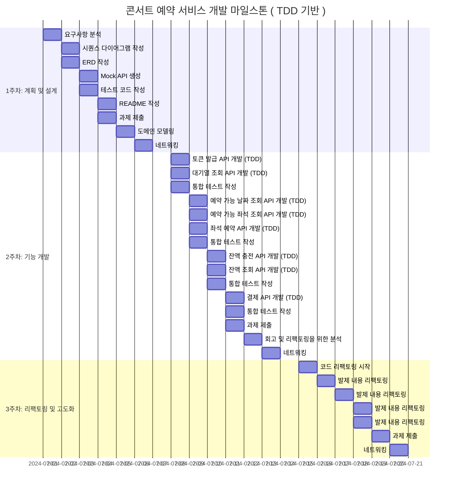
</details>

## 💡Sequence
<details>
<summary> Sequence Diagrams</summary>

</Br>

<details>
<summary> 토큰 발급 API (POST)</summary>

### 토큰 발급 API (POST)
> 대기열 토큰 발급
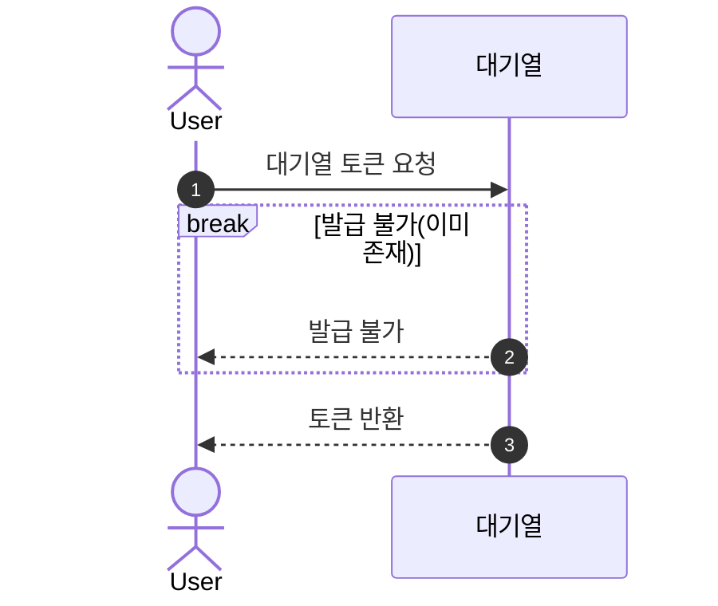
</details>

<details>
<summary> 대기열 상태 확인 API (GET)</summary>

### 대기열 상태 확인 API (GET)
> 대기열 상태 확인
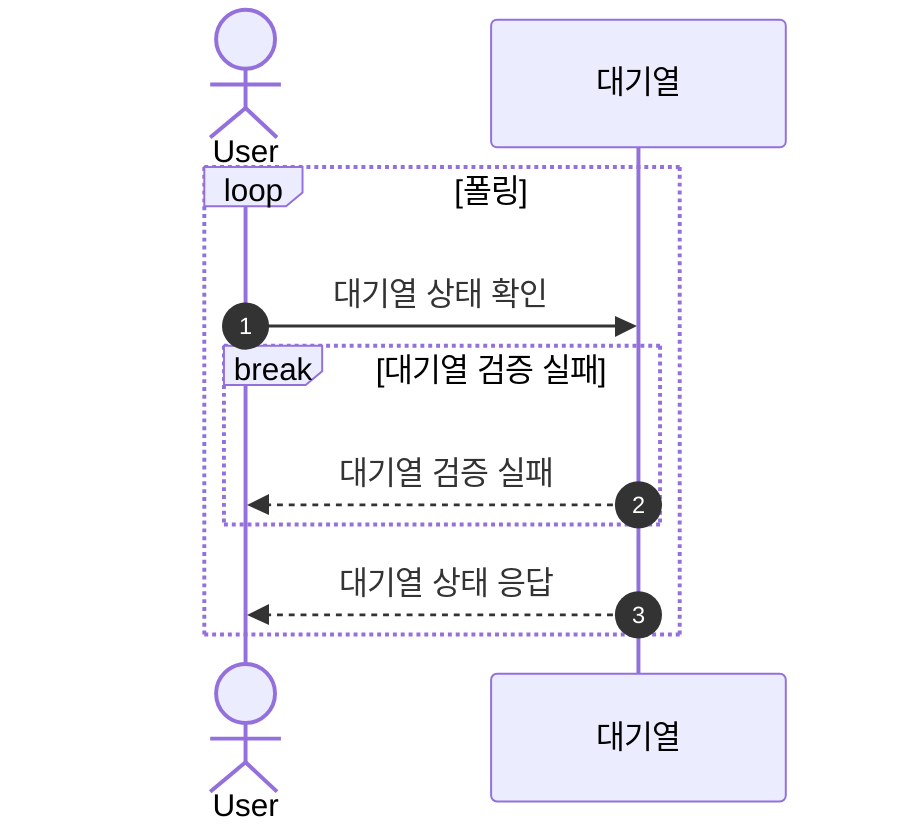
</details>

<details>
<summary> 예약 가능 날짜 조회 API (GET)</summary>

### 예약 가능 날짜 조회 API (GET)
> 예약 가능 좌석 조회
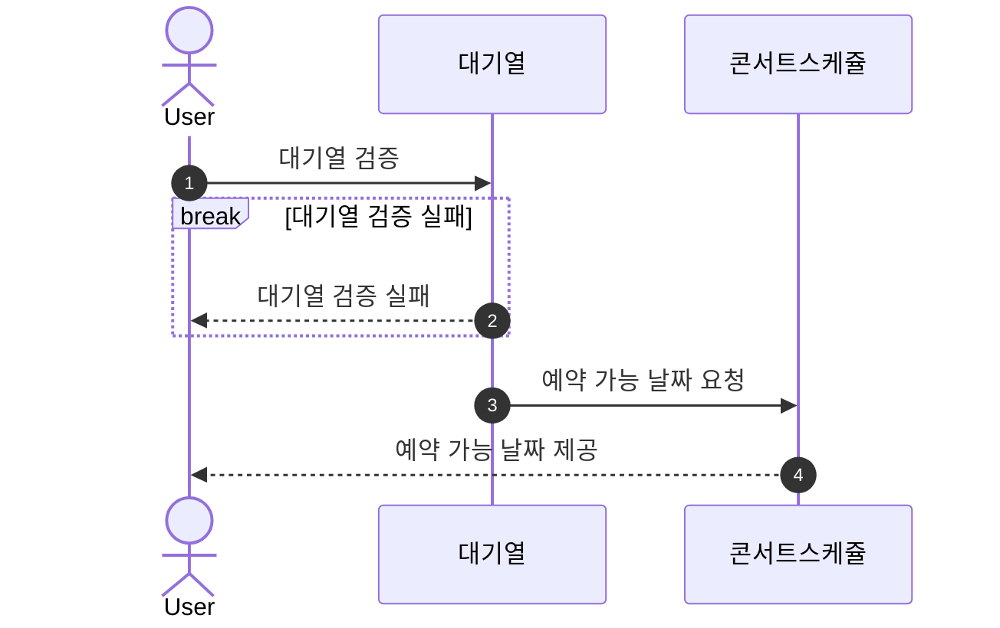
</details>

<details>
<summary> 예약 가능 좌석 조회 API (GET)</summary>

### 예약 가능 좌석 조회 API (GET)
> 예약 가능 좌석 조회
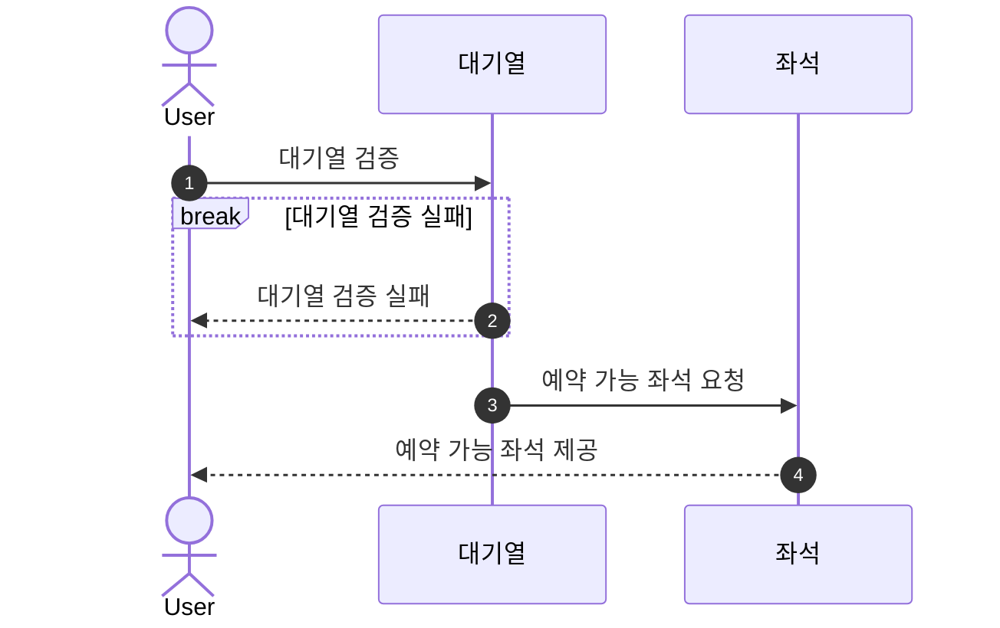
</details>

<details>
<summary> 잔액 충전 API (POST)</summary>

### 잔액 충전 API (POST)
> 예약 가능 좌석 조회 요청

</details>

<details>
<summary> 잔액 조회 API (GET)</summary>

### 잔액 조회 API (GET)
> 예약 가능 좌석 조회
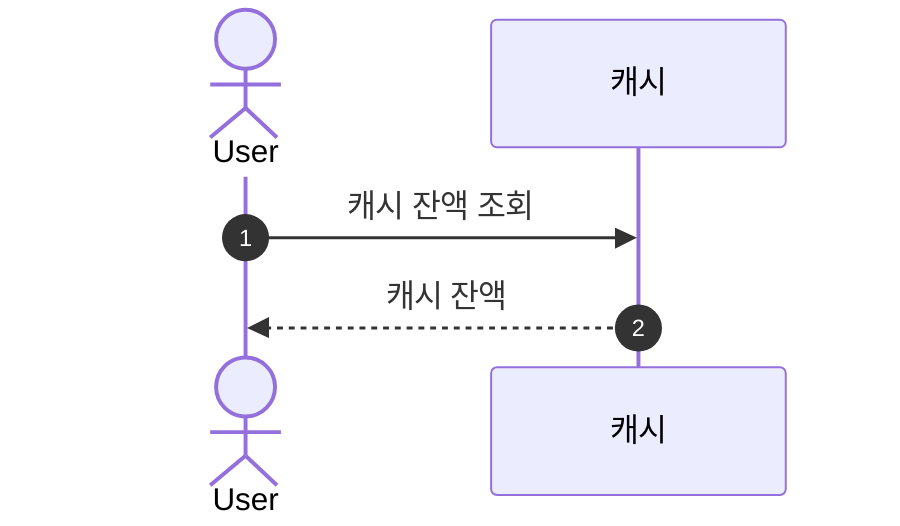
</details>

<details>
<summary> 좌석 예약 API (POST)</summary>

### 좌석 예약 API (POST)
> 좌석 예약 요청
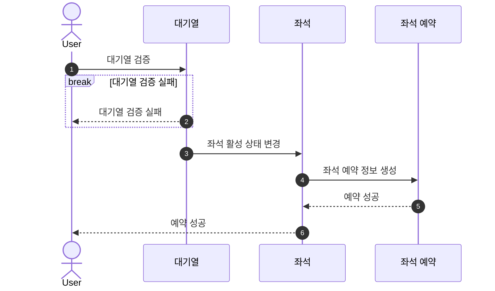
</details>

<details>
<summary> 결제 API (POST)</summary>

### 결제 API (POST)
> 결제
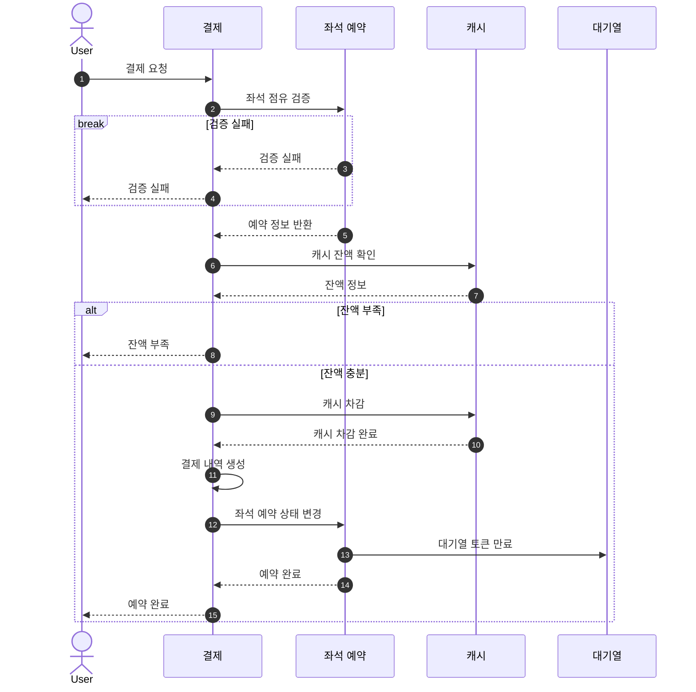
</details>

<details>
<summary> BACKGROUND-A</summary>

### BACKGROUND-A
> 대기열 만료 처리
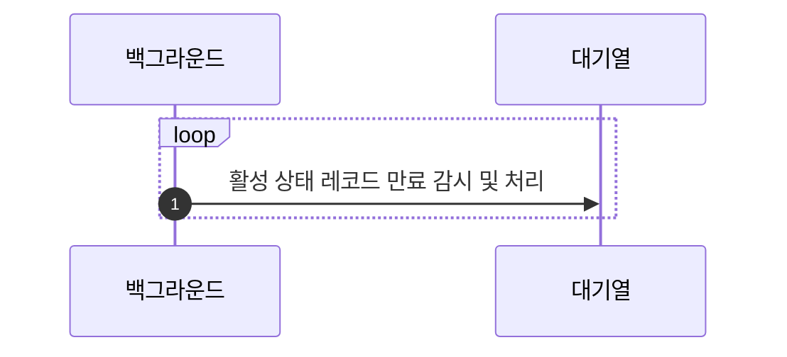
</details>

<details>
<summary> BACKGROUND-B</summary>

### BACKGROUND-B
> 좌석 예약 만료 처리
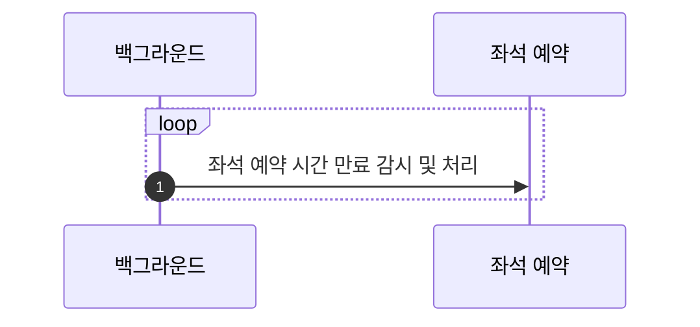
</details>

</details>


## 🗂️ ERD

<details>
<summary> ERD</summary>


</details>


<!-- ## API

<details>
<summary>🔍 API Documentation</summary>

### API 명세서

#### 1. 유저 토큰 발급

- **경로**: `POST /queue/issue`
- **설명**: 대기열 토큰을 발급받습니다.
- **Request**:
    - **Body**
        - `userId`: `string` - 사용자 ID
- **Response**:
    - **200 OK**:
        ```json
        {
          "success": true,
          "data": {
            "token": "queue-uuid",
            "status": "pending"
          }
        }
        ```
    - **400 Bad Request**: `userId`가 유효하지 않을 때
        ```json
        {
          "success": false,
          "message": "Invalid userId"
        }
        ```

#### 2. 예약 가능 날짜 조회

- **경로**: `GET /concert/available-dates`
- **설명**: 예약 가능한 날짜 목록을 조회합니다.
- **Request**: 
    - **Headers**
        - `queue-token`: `string` - 대기열 토큰
- **Response**:
    - **200 OK**:
        ```json
        {
          "success": true,
          "data": [
            {
              "id": 1,
              "totalSeats": 50,
              "reservedSeats": 38,
              "open_at": "2024-01-01T00:00:00",
              "close_at": "2024-01-01T00:00:00"
            },
            {
              "id": 2,
              "totalSeats": 50,
              "reservedSeats": 48,
              "open_at": "2024-01-03T00:00:00",
              "close_at": "2024-01-03T00:00:00"
            }
          ]
        }
        ```
    - **401 Unauthorized**: 큐 토큰이 없거나 유효하지 않을 때
        ```json
        {
          "success": false,
          "message": "Unauthorized"
        }
        ```

#### 3. 예약 가능 좌석 조회

- **경로**: `GET /concert/available-seats`
- **설명**: 특정 콘서트 일정에 예약 가능한 좌석 목록을 조회합니다.
- **Request**:
    - **Headers**
        - `queue-token`: `string` - 대기열 토큰
    - **Query Parameters**
        - `concertScheduleId`: `number` - 콘서트 일정 ID
- **Response**:
    - **200 OK**:
        ```json
        {
          "success": true,
          "data": [
            {
              "id": 1,
              "seatNumber": "1",
              "price": 1000
            },
            {
              "id": 2,
              "seatNumber": "50",
              "price": 5000
            }
          ]
        }
        ```
    - **400 Bad Request**: `concertScheduleId`가 유효하지 않을 때
        ```json
        {
          "success": false,
          "message": "Invalid concertScheduleId"
        }
        ```
    - **401 Unauthorized**: 큐 토큰이 없거나 유효하지 않을 때
        ```json
        {
          "success": false,
          "message": "Unauthorized"
        }
        ```

#### 4. 좌석 예약 요청

- **경로**: `POST /reservation`
- **설명**: 좌석 예약을 요청합니다.
- **Request**:
    - **Headers**
        - `queue-token`: `string` - 대기열 토큰
    - **Body**
        - `seatId`: `number` - 좌석 ID
- **Response**:
    - **200 OK**:
        ```json
        {
          "success": true,
          "data": {
            "id": 1,
            "seat": {
              "id": 1,
              "isActive": false,
              "seatNumber": 1
            },
            "status": "PENDING",
            "created_at": "2024-01-01T00:00:00"
          }
        }
        ```
    - **400 Bad Request**: `seatId`가 유효하지 않을 때
        ```json
        {
          "success": false,
          "message": "Invalid seatId"
        }
        ```
    - **401 Unauthorized**: 큐 토큰이 없거나 유효하지 않을 때
        ```json
        {
          "success": false,
          "message": "Unauthorized"
        }
        ```

#### 5. 잔액 충전

- **경로**: `POST /user/charge`
- **설명**: 유저의 포인트를 충전합니다.
- **Request**:
    - **Body**
        - `amount`: `number` - 충전할 금액
        - `userId`: `string` - 사용자 ID
- **Response**:
    - **200 OK**:
        ```json
        {
          "success": true,
          "data": {
            "balance": 1000
          }
        }
        ```
    - **400 Bad Request**: `amount`나 `userId`가 유효하지 않을 때
        ```json
        {
          "success": false,
          "message": "Invalid amount or userId"
        }
        ```

#### 6. 잔액 조회

- **경로**: `GET /user/check`
- **설명**: 유저의 포인트 잔액을 조회합니다.
- **Request**:
    - **Query Parameters**
        - `userId`: `string` - 사용자 ID
- **Response**:
    - **200 OK**:
        ```json
        {
          "success": true,
          "data": {
            "balance": 1000
          }
        }
        ```
    - **400 Bad Request**: `userId`가 유효하지 않을 때
        ```json
        {
          "success": false,
          "message": "Invalid userId"
        }
        ```

#### 7. 결제 요청

- **경로**: `POST /payment`
- **설명**: 결제를 요청합니다.
- **Request**:
    - **Headers**
        - `queue-token`: `string` - 대기열 토큰
    - **Body**
        - `seatId`: `number` - 좌석 ID
- **Response**:
    - **200 OK**:
        ```json
        {
          "success": true,
          "data": {
            "seatNumber": 1,
            "concertName": 1,
            "openDate": "2024-01-01T00:00:00",
            "closeDate": "2024-01-01T00:00:00",
            "totalAmount": 1000,
            "status": "PENDING"
          }
        }
        ```
    - **400 Bad Request**: `seatId`가 유효하지 않을 때
        ```json
        {
          "success": false,
          "message": "Invalid seatId"
        }
        ```
    - **401 Unauthorized**: 큐 토큰이 없거나 유효하지 않을 때
        ```json
        {
          "success": false,
          "message": "Unauthorized"
        }
        ```
</details> -->

## 🔍 Swagger

<details>
<summary> Swagger </summary>
<br>

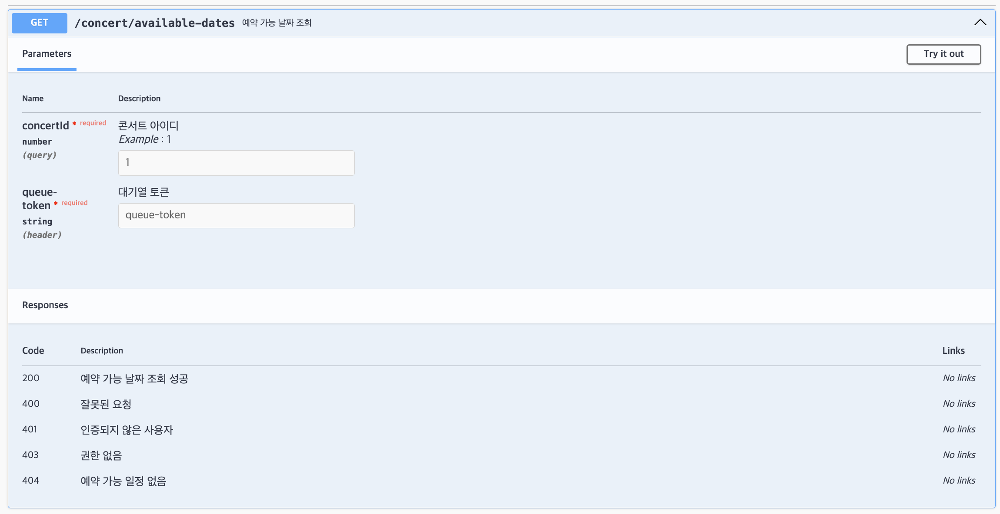

<br>


<br>


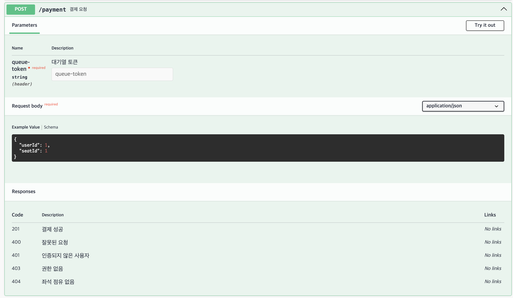

<br>


<br>


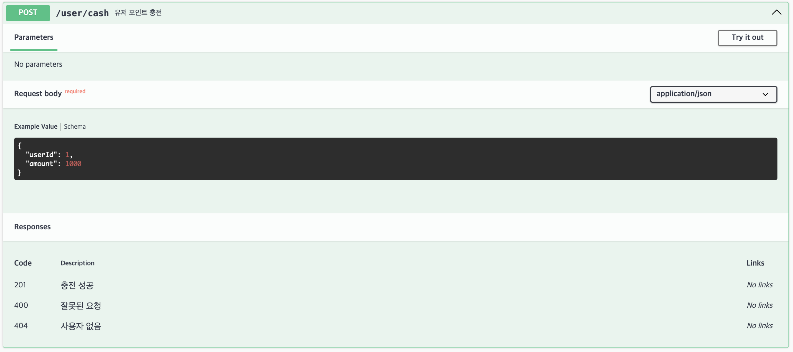

<br>


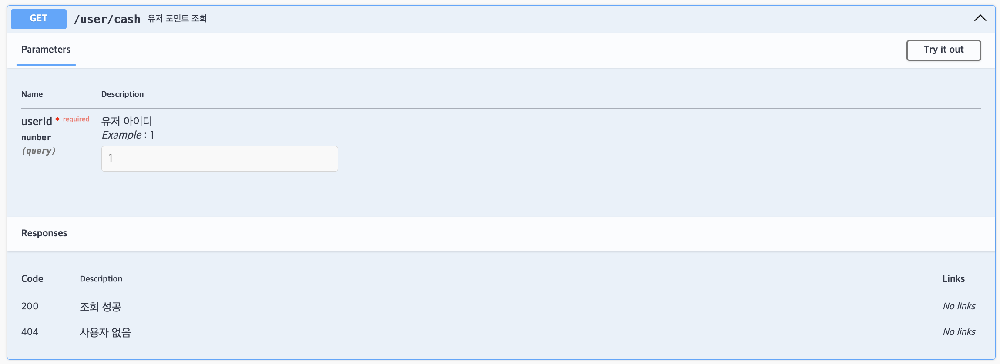

<br>


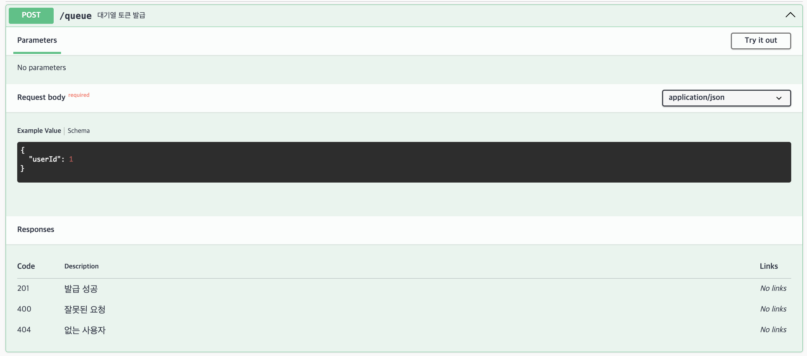

<br>


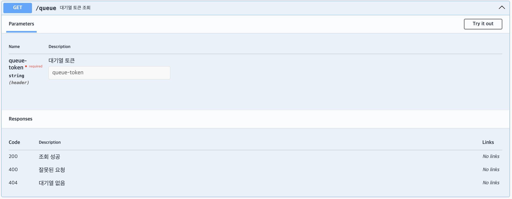

</details>

## 🔒 Concurrency Control

<details>
<summary> Concurrency Control </summary>
<br>

# 동시성 제어 방식 비교 및 구현

## 동시성 문제 발생 지점
- 콘서트 예약 인원
```
다수의 유저가 동일한 좌석 점유를 시도 한다 =>
콘서트 스케쥴 테이블의 reserved_seat 숫자 증가 문제 발생

좌석점유가 해제된다 =>
콘서트 스케쥴 테이블의 reserved_seat 숫자 감소 문제 발생
(다른 요청의 숫자 증가와 겹치는 등)
```
- 콘서트 좌석 점유
```
다수의 유저가 동일한 좌석을 점유한다 =>
좌석이 Active 상태이면 예약 테이블에 예약 데이터가 생성된다=>
읽기 시점 Active 였던 인원들 전부 동일한 좌석으로 예약이 생성되는 문제
```
- 유저 캐시 사용
```
돈은 요청 간격에 상관없이 무조건 각각의 요청을 모두 반영한다.
```
- 유저 캐시 충전
```
돈은 요청 간격에 상관없이 무조건 각각의 요청을 모두 반영한다.
```

## 환경
- OS: macOS
- CPU: Apple M3 Pro, 11-core , 14-core GPU
- Memory: 18GB LPDDR5
- Storage: 512GB SSD
- Docker
- ELK
- Grafana
- Prometheus


## 테스트 신뢰성
- 로컬에서 진행되어 테스트 케이스 이외의 요인에 의한 자원 소모가 있습니다.
- 각 테스트 케이스 실행 시 테스트에 필요한 데이터 시딩으로 인해 자원 소모가 있습니다.
- 종합: 모니터링 데이터는 실제 테스트 케이스에 의한 변동값 이외의 요인에 의한 값도 반영되어 있기 때문에 참고용으로만 봐주시기 바랍니다.


## 참고자료 링크
- https://dev.mysql.com/doc/refman/8.4/en/innodb-locking.html
- https://dev.mysql.com/doc/refman/8.4/en/innodb-transaction-model.html
- https://redis.io/topics/internals
- https://redis.io/commands/publish
- https://redis.io/docs/latest/develop/interact/pubsub/
- https://redis.io/topics/distlock
- https://www.rabbitmq.com/documentation.html
- https://kafka.apache.org/documentation/
- https://www.rabbitmq.com/getstarted.html

## 동시성 제어 방식

### 1. Simple Lock
- **설명**: 간단하게 락을 획득하고 릴리즈하는 방식
- **장점**: 구현이 간단하다.
- **단점**: 분산 환경에서 사용이 불가능하고 대용량 트래픽 시 부하가 크다.
<details>
  <summary> 📈 테스트 자료 </summary>

  ### 캐시 사용 , 충전. { 각 실행 수 : 3000 }

  
  

  
  - **테스트 소요 시간**


   

</details>

```
가장 간단한 Lock 전략이다.

구현 가능하지만 분산환경에서는 사용할 수 없다.

사용 환경이 모놀리틱하다고 하더라도 만약 단순히 락 획득에 실패하면 '나가' 할 거면 모를까

획득 재시도를 일정 주기마다 한다면 대용량 트래픽이 쏟아질 때 nodejs 같은 싱글 스레드는 더욱 더 성능 이슈가 생길 수밖에 없다.

```


### 2. Spin Lock
- **설명**: 락이 있는지 없는지 계속 확인하며 기다리는 방식
- **장점**: 구현이 간단하다.
- **단점**: 싱글 스레드 환경에서는 성능에 큰 영향을 미치고 이벤트 루프가 블로킹될 수 있다.
```
심플락은 일정 주기마다 재실행했다면 이 스핀락은 스레드를 쉬지 않고 굴리는 락이다. (스레드가 빙빙 돈다고 스핀락이라고 한다더라)

자바 같은 멀티스레드는 어떨지 모르겠지만 nodejs 같은 싱글 스레드는 while로 스레드를 계속 굴리면 이벤트 루프가 블로킹 된다.

실제로 테스트를 해보니 요청이 2개만 동시에 들어가도 서버 전체가 굳어버린다.

첫 번째 요청이 작업을 처리하는 동안 두 번째 요청이 스핀을 돌며 

스레드를 점유해버려서 진행 중이던 요청, 들어오는 요청 모두 블로킹 된다.

이건 테스트 자료가 무의미하다.
```

### 3. Pessimistic Lock (비관적 락)
- **설명**: 트랜잭션이 특정 데이터 항목에 접근할 때 다른 트랜잭션이 접근하지 못하도록 잠그는 방식
- **장점**: 더티 리드 문제가 없다.
- **단점**: 대용량 트래픽 발생시 디비에 부하를 전가시킨다. 시스템 전반에 장애를 야기할 수 있다.

<details>
  <summary> 📈 테스트 자료 </summary>

  ### 캐시 사용 , 충전. { 각 실행 수 : 3000 }


  
  
  - ** 테스트 소요 시간  **


  
  </details>
  
```
위 테스트 자료 중 Lock Waits와 Lock Time 차트를 보면 알겠지만 락 경합이 발생한 것을 알 수 있다.

즉 DB락을 직접 이용하는 락이다.

비관적 락이라는 건 구체적인 기능이 아니라 트랜잭션의 접근 방지를 위한 데이터 선점 전략을 표현한 개념이다.

이 개념에 속하는 구체적인 구현 기능들이 배타락, 공유락이라고 보면 될 것 같다.

공유락은 트랜잭션들이 읽기는 가능하지만 쓰기는 불가능하게 한다. (SELECT * FROM sexy WHERE 태환 = 1 FOR SHARE)

보통 데이터 분석이나 보고서 작성 혹은 금융 데이터 등에 사용이 많이 된다.

예를 들어 a와 b의 계좌에서 돈이 오고 가야 하는 경우라면 이 계좌는 트랜잭션이 진행되는 동안 변경되어서는 안 된다.

이때 공유락을 걸어 모두 읽을 수는 있지만 변경되지는 않게 한다.

배타락은 엄격하게 동시성 제어를 해야 할 경우에 사용된다.

동시에 접근하는 트랜잭션들 중 하나의 트랜잭션에게만 접근 권한을 부여한다. (SELECT * FROM sexy WHERE 태환 = 1 FOR UPDATE)

이렇게 하면 트랜잭션은 한 번에 하나씩만 해당 데이터에 접근할 수 있다.

조금 더 이해하기 쉽게 innoDB 엔진이 내부적으로 어떻게 트랜잭션 Lock을 처리하는지를 다음과 같이 풀어보았다.

1. a-tx, b-tx, c-tx, d-tx => 동시에 동일한 좌석 레코드를 점유하기 위해 접근.
2. innoDB 엔진은 먼저 도착한 c-tx(가정)의 요청 lock 정보를 읽고 lock list를 생성한다.
3. lock list에는 요청받은 락 종류와 요청한 c-tx 정보를 담고 c-tx의 상태를 기록한다. => RUNNING
4. 나머지 tx는 lock queue를 생성하여 저장한다.
5. c-tx의 작업이 커밋 또는 롤백되면 innoDB는 lock list에서 c-tx의 상태를 변경하고 큐에서 다음 tx를 꺼내 lock list에 적재시킨다.

innoDB 엔진은 위와 같은 플로우로 배타락을 처리하여 한 번에 하나의 트랜잭션에게만 접근 권한을 부여함으로써 트랜잭션의 일관성과 격리성을 보장한다.

위와 같이 Lock 처리를 우리가 체감하지 못하는 사이에 (물론 대용량 I/O에서는 많이 체감되겠지만) 내부적으로 많은 일이 일어나고 있는데, 그만큼 요청이 많아지면

DB 부하가 많이 생길 수밖에 없다.

운영 서비스의 트래픽이 전체적으로 널널하고 어쩌다 한 번 약간의 스파이크가 생기는, 낙관락으로 처리하기는 조금 버거운 정도라면 충분히 효율적이라고 생각한다.

그러나 대규모 트래픽을 모두 배타락으로 받아버리면 DB에 부하가 몰려 전반적인 서비스 품질이 낮아지고 광범위한 시스템 장애를 초래할 수 있다.
```


### 4. Optimistic Lock (낙관적 락)
- **설명**: 읽기와 쓰기를 자유롭게 허용하지만, 쓰기 시점에 버전 컬럼을 확인해 변경을 감지하는 방식
- **장점**: 디비 락 이라기 보다는 전략으로써 직접적으로 디비에 락을 걸지않아 부하가 적다.
- **단점**: 동시성 문제가 빈번하고 대규모 트래픽일 경우 성능 이슈가 생긴다.

<details>
  <summary> 📈 테스트 자료 </summary>

  ### 캐시 사용 , 충전. { 각 실행 수 : 3000 }


  
  - **테스트 소요 시간**


</details>


```
위 테스트 자료를 보면 한 가지 의문이 생긴다.

'분명 낙관락은 디비 락이 아니라 그냥 전략이라면서 왜 락 경합이 감지된 거지?'

위 의문을 설명하기 전에 간단하게 낙관락의 작동 방식을 알아보자.

낙관락은 기본적으로 버전 컬럼을 이용해 조회 시점의 version과 update 시점의 version을 비교하여 버전이 그대로라면 최종 수정을 한다.

즉 DB 락을 이용하는 게 아니라 전략적으로 lock을 구현하는 것이다.

그럼 이때 DB락을 쓰지 않는데 왜 트랜잭션 경합이 감지된 걸까?

그 이유는 innoDB의 update 처리 방식에 있다.

innoDB는 특정 레코드를 update하기 위해 조건에 맞는 인덱스를 찾아 레코드 락을 걸게 된다.

해당 레코드를 읽은 시점과 update 사이에 값이 변경되면 안 되기 때문인데, 이 때문에 낙관락을 사용할 때 트랜잭션 경합이 감지되는 것이다.

조금 더 풀어서 이야기하면 동시에 여러 트랜잭션이 인덱스를 찾아 접근할 때 먼저 도착한 트랜잭션이 이전 비관락에서 설명했던 것처럼 해당 레코드를 선점하게 되고

나머지 트랜잭션은 앞서 선점한 트랜잭션이 커밋 혹은 롤백하기를 기다리게 되는데 이 때문에 트랜잭션 경합이 그래프나 차트에 감지된 것이다.

이렇게 보면 앞서 설명했던 배타락보다는 잠금 범위가 굉장히 좁기 때문에 상대적으로 리소스가 덜 든다고 느껴진다.

' 어 그럼 비관락 왜씀? 그냥 다 낙관락으로 처리하는 게 짱 아님? '

만약 동시성 이슈가 발생할 가능성이 낮고 있더라도 어쩌다 높지 않은 트래픽이라면 retry 전략과 함께 충분히 효율적으로 처리가 가능할 것이다.

그러나 대용량 트래픽과 동시성 이슈 발생 가능성이 높은 곳에 이렇게 사용하게 되면 결국 CPU 바운드가 발생할 가능성이 높아진다. (트랜잭션 경합까지 겹쳐 지연 시간은 계속 늘어난다.) 

nodejs를 사용하는 입장에서는 위 심플락과 스핀락에서 언급했던 nodejs의 특성으로 인해 더욱 치명적일 수 있으니 충분히 innoDB의 CRUD 메커니즘을 이해하고 상황에 맞게 사용해야 한다.
```
  
### 5. Pub/Sub Lock (Redis)
- **설명**: Redis의 Pub/Sub 기능을 이용해 락을 획득하고 해제하는 방식
- **장점**: 메시지 기반으로 비동기 처리가 가능하다.
- **단점**: Redis Pub/Sub은 전달 성공을 보장하지 않으므로 메시지 손실 가능성이 있다.

<details>
  <summary> 📈 테스트 자료 </summary>

  ### 캐시 사용 , 충전. { 각 실행 수 : 3000 }


  
  - **테스트 소요 시간**


</details>

```
Pub/Sub Lock은 레디스의 메시지 발행 기능을 이용해 구현한 락이다.

Redis의 pub/sub 작동 방식을 대략적으로 이해한다면 이를 이용한 lock을 어떻게 구현하는 것인지 조금 더 이해하기 쉬울 것이다.

Redis의 pub/sub은 대략적으로 다음의 프로세스로 처리된다.

1. 사용자가 publish를 이용해서 'taehwan'이라는 메시지를 발행한다.
2. Redis 서버는 발행을 감지하면 해시테이블에서 전달받은 'taehwan'이라는 채널을 구독하는 구독자 목록을 조회한다.
3. 조회된 구독자들은 Redis 서버와 TCP 소켓으로 연결되어 있는데, Redis는 각 구독자의 소켓 버퍼에 쓰여진다.
4. 구독자는 쓰여진 메시지를 소켓에서 읽어낸다.

TCP를 쓰다 보니 기본적으로 순서가 보장된다는 점과 Redis의 단일 스레드로 인한 순차 처리 특징이 결합되어 메시지 순차 전달을 보장할 수 있다.

이제 대략적으로 Redis의 pub/sub이 어떻게 동작하는지 알게 되었으니 이걸로 lock을 어떻게 쓰겠다는 건지 이해가 될 것이다.

대략적으로 다음과 같은 형태를 취할 것이다.

1. 최초에 락을 획득한다.
2. 이후 요청은 락 획득에 실패하고 lock:xx 채널을 구독하고 대기한다.
3. 최초에 락을 획득한 스레드가 작업을 마치고 락을 해제하며 락 해제 메시지를 발행한다.
4. 구독하고 대기하던 다음 요청이 메시지를 받고 락을 획득한다.

이제 직접 주기적으로 락 상태를 확인하고 획득하는 로직을 구현할 필요가 없어졌다.

DB에 부하를 주지 않으며 Redis의 빠른 처리 속도로 빠르게 동시성 제어를 할 수 있게 되었다.

그러나 이 방식에도 문제점이 존재한다.

위에서 이야기했듯이 이 방식은 소켓을 이용한다.

대용량 트래픽일 경우에는 많은 리스너가 계속해서 소켓을 연결하고 대기해야 하고 락 획득을 위한 재시도 로직으로 인한 부하도 발생할 수 있으니 부하가 상당해질 수밖에 없다.

이렇게 소켓 의존도가 높다 보니 잠깐이라도 네트워크 유실 혹은 장애가 발생할 경우 모든 메시지가 소실될 수 있다.

그리고 무엇보다 Redis의 pub/sub 기능은 메시지 전달과 내구성을 보장하지 않는다.

그렇기 때문에 메시지 소실이 상당한 장애를 초래하거나 손실을 야기할 수 있는 로직에는 충분히 고민하고 적용시켜야 한다.

```


### 6. Redis 분산 락
- **설명**: RedLock 알고리즘을 이용해 락 획득 및 해제 방식
- **장점**: 빠른 속도 , 간단한 구현
- **단점**: Redis 서버 장애 시 문제가 발생할 수 있다.

<details>
  <summary> 📈 테스트 자료 </summary>

  ### 캐시 사용 , 충전. { 각 실행 수 : 3000 }


  
  - **테스트 소요 시간**


</details>

```
레디스를 이용해 분산 락을 구현하는 방식은 여러 가지가 있지만 나는 Redis가 공식적으로 분산 환경에서 사용하기를 권장하는 Redlock을 사용해 보았다.

레디스에서 Redlock을 공식적으로 권장하는 이유는 다음과 같다.

1. Redlock 알고리즘은 여러 노드를 이용해 락을 분산시켜 단일 노드보다 안전하고 네트워크 파티션이나 노드 장애가 발생해도 락의 일관성을 유지한다.
2. 1번의 이유로 고가용성을 보장한다.
3. 분산 환경에서도 노드 분산으로 데이터 일관성을 보장한다.

Redlock 알고리즘의 작동 방식은 다음과 같다.

1. 다수의 Redis 노드 설정
2. 클라이언트는 모든 Redis 노드에 동일한 키를 설정하고, 일정 시간(TTL) 동안 락 획득 시도
3. 과반수 성공 확인: 일정 수(N/2 + 1) 이상의 노드에서 락을 성공적으로 획득했는지 확인
4. 락의 TTL이 만료되기 전에 갱신하거나, 작업이 완료되면 락을 해제

추가적으로 다수의 요청으로 인한 충돌을 완화하기 위해 지수적 백오프를 적용시키면 효율이 더욱 향상된다.

노드를 확장하거나 클러스터링함으로써 트래픽에 효과적으로 대응할 수 있다는 장점도 존재한다.

그러나 순간 대용량 트래픽 스파이크가 발생할 경우 대기가 많아지면 재시도 처리로 인한 부하가 발생할 수 있으니 이 부분을 잘 고려해야 한다.

락 획득, 검증 등과 같은 간단한 데이터 처리에는 굉장히 효율적이고 강력하다고 생각한다.

```

### 7. Kafka를 이용한 동시성 제어
- **설명**: 카프카의 단일파티션 특성을 이용한 동시성 제어
- **장점**: 고가용성, 확장성, 높은 성능
- **단점**: 구현 복잡도가 높고 러닝커브가 있다.

<details>
  <summary> 📈 테스트 자료 </summary>

  ### 캐시 사용 , 충전. { 각 실행 수 : 3000 }


  
  - **테스트 소요 시간**


</details>

```
카프카는 대용량 데이터 스트리밍에 특화되어 있어 정말 많은 곳에서 사용되고 있다.

로그 처리, 분석, 데이터 파이프라인, 이벤트 처리 등 다양한 용도로 활용된다.

그러나 지금은 동시성 제어에 대한 이야기를 하고 있으니 다른 기능들에 대한 설명은 나중으로 미루어두고 어떻게 동시성 제어가 되는지 알아보자.

카프카는 크게 프로듀서(Producer), 브로커(Broker), 컨슈머(Consumer)로 나누어져 있다.

브로커는 카프카 클러스터를 구성하는 서버 인스턴스이다.

토픽이라는 데이터 카테고리를 기준으로 파티션이 생성되며, 각 토픽은 하나 이상의 파티션으로 나뉘어진다.

이 파티션들은 브로커에 분산 저장되어 병렬 처리가 가능하게 한다.

카프카를 이용해 동시성 제어가 가능한 이유는 파티션 내에 데이터를 보관할 때 오프셋을 포함시킨다는 것과 단일 파티션일 때는 하나의 컨슈머에게 순서대로 메시지를 제공하기 때문이다.

이를 기반으로 메시지를 순차적으로 소비할 수 있고, 장애 발생 혹은 컨슈머가 일정 기간 메시지를 소비하지 않다가 다시 메시지를 가져갈 때도 마지막 메시지 이후 데이터를 반환함으로써 순서를 보장할 수 있다.

그러나 토픽을 여러 파티션으로 나누게 되면 데이터가 병렬로 처리되기 때문에 동시성 제어에는 적합하지 않다.

테스트 자료를 보면 알 수 있듯 성능은 지금까지 테스트한 다른 무엇보다도 강력하다.

궁금해서 요청 수를 3만 개로 늘려봤는데 0.3초 걸리던 게 0.6초로 늘어난 게 끝이다.

구현 복잡도가 높고 동시성 제어만으로 사용하기에는 오버엔지니어링이라고 생각한다.


```


### 8. RabbitMQ를 이용한 동시성 제어
- **설명**: 메시징 큐의 특성을 이용해 순차적으로 메시지를 소비하며 동시성 제어
- **장점**: 메시지의 신뢰성이 높다.
- **단점**: 대용량 데이터 스트림에는 부족하다.


<details>
  <summary> 📈 테스트 자료 </summary>

  ### 캐시 사용 , 충전. { 각 실행 수 : 3000 }


  
  - **테스트 소요 시간**


</details>

```
RabbitMQ는 AMQP(Advanced Message Queuing Protocol)를 기반으로 설계되었으며, 메시지 큐잉과 다양한 메시징 패턴(라우팅, 주제 기반 메시징, 작업 큐 등)을 지원한다.

RabbitMQ도 카프카처럼 정말 많은 기능과 활용 범위가 있지만, 지금은 동시성 제어에 대해서만 이야기를 할 것이기 때문에 나머지는 나중에 또 알아보자.

RabbitMQ는 기본적으로 메시지를 받아 큐에 저장하고 컨슈머가 이를 가져가 처리하는 방식을 취하는데, 이러한 특성 때문에 동시성 제어 또한 쉽게 구현해낼 수 있다.

그리고 RabbitMQ는 메시지 전달을 보장하고 메시지 내구성을 제공하는데 (카프카만큼은 아니지만) 이를 통해 장애 복구 등 메시지 전달 신뢰성을 가지고 있다.

또한 확장도 쉽게 할 수 있고 구현 복잡도도 그다지 높지 않기 때문에 정말 좋은 선택이라고 생각한다.

대용량 데이터를 처리할 때 처리 용량을 넘어서게 되면 메시지를 플러시하면서 성능이 급격히 떨어질 수 있다는 점은 주의해야 한다.

테스트 결과를 보면 알겠지만 정말 강력하다.

동시성 제어만으로는 RabbitMQ도 오버엔지니어링이라고 생각한다.

```


## 동시성 제어 방식의 비교

| 방식         | 구현 복잡도 | 성능          | 효율성    | 장점                                                    | 단점                                                      |
|--------------|-------------|---------------|-----------|---------------------------------------------------------|-----------------------------------------------------------|
| Simple Lock  | 낮음        | 중            | 중        | 구현이 간단                                              | 분산 환경에서 사용 불가, 대용량 트래픽 시 부하 큼           |
| Spin Lock    | 낮음        | 낮음          | 낮음      | 구현이 간단                                              | 성능에 큰 영향, 이벤트 루프 블로킹 가능                    |
| Pub/Sub Lock | 중간        | 중            | 중        | 메시지 기반 비동기 처리 가능                              | 메시지 손실 가능성                                        |
| Pessimistic Lock | 중간    | 낮음          | 낮음      | 더티 리드 문제 없음                                      | 많은 트랜잭션 시 성능 저하                                 |
| Optimistic Lock  | 중간    | 중            | 중        | 충돌이 적은 환경에서 유효                                | 동시성 제어가 빈번한 환경에서는 성능 저하                         |
| Redis 분산 락     | 중간    | 높음          | 높음      | 빠른 속도                                                | Redis 서버 장애 시 문제 발생 가능                          |
| Kafka를 이용한 동시성 제어     | 높음    | 높음          | 높음      | 고가용성, 확장성                                          | 설정이 복잡, 러닝커브 있음                                               |
| RabbitMQ를 이용한 동시성 제어  | 높음    | 높음          | 높음      | 메시지 신뢰성 높음 , 비교적 간단한 설정                     | 대용량 데이터 처리 한계                                               |

## DB Lock을 활용한 동시성 제어 방식 구현

### 비즈니스 로직에 적합한 동시성 제어 방식

- **생각**: 적절한 트랜잭션 배치 및 Redis 분산락
- **선택한 방식**: 카프카
- **이유**
```
why
과제 요구사항으로는 적절한 트랜잭션 배치와 레디스를 이용한 분산 락으로도 충분하다고 생각했다.
그러나 종류별로 동시성 제어를 위해 테스트 구현체를 만들어 테스트를 하다 보니 카프카의 광범위한 활용 범위를 알게 되었고,
이 부분을 조금 더 학습해 보고 싶어 시작이 반이라는 마음으로 일단 적용시켜 보며 학습하고자 선택하게 되었다.

1. 요청을 비동기적으로 처리할 수 있어 트래픽이 많이 몰려도 응답 속도가 굉장히 빠르다.
2. 파사드가 필요 없어지고, 애플리케이션 레이어에서도 도메인 응집도를 높일 수 있다.
3. 각각의 메소드(로직)는 자신의 관심사만 처리할 수 있다. (e.g., 결제는 결제만 하고 결제 정보를 발행)
4. 확장 가능성이 높다. 예를 들어 로그 수집, MSA 추가 학습, 데이터 파이프라인 구축 경험 등

worry
1. 트랜잭션 처리가 복잡해진다. (보상 트랜잭션을 구현해야 함)
```


</details>


