### [`mock api commit link`](https://github.com/nowhereim/concert-nest/commit/16ad9a74406d2e6387a7eb3761515fe369336c73)
PR이 아닌 저장소 제출로 피드백은 위 링크 커밋 코멘트 주시면 감사하겠습니다.
<br>
`e.g : ERD 실화에요? 불합격.`

# 콘서트 예약 서비스

<aside>
💡 분산 환경에서도 대기열처리가 가능한 서버를 구현합니다.

## Description

- **`콘서트 예약 서비스`** 를 구현합니다.
- 대기열 시스템을 구축하여, 예약 서비스는 작업 가능한 유저만 수행할 수 있도록 합니다.
- 사용자는 좌석 예약 시에 미리 충전한 잔액을 이용합니다.
- 좌석 예약 요청 시 결제가 이루어지지 않더라도 일정 시간 동안 다른 유저가 해당 좌석에 접근할 수 없도록 합니다.

## Requirements

- 아래 5가지 API를 구현합니다.
    - 유저 토큰 발급 API
    - 예약 가능 날짜 / 좌석 API
    - 좌석 예약 요청 API
    - 잔액 충전 / 조회 API
    - 결제 API
- 각 기능 및 제약사항에 대해 단위 테스트를 반드시 하나 이상 작성합니다.
- 다수의 인스턴스로 애플리케이션이 동작하더라도 기능에 문제가 없도록 작성합니다.
- 동시성 이슈를 고려하여 구현합니다.
- 대기열 개념을 고려하여 구현합니다.

## API Specs

1️⃣ **`주요` 유저 대기열 토큰 기능**

- 서비스를 이용할 토큰을 발급받는 API를 작성합니다.
- 토큰은 유저의 UUID와 해당 유저의 대기열을 관리할 수 있는 정보(대기 순서 또는 잔여 시간 등)를 포함합니다.
- 이후 모든 API는 이 토큰을 이용해 대기열 검증을 통과해야 이용 가능합니다. 
- `먼저 DB로 토큰을 구현` 하고 점진적으로 다른 스택으로 리팩토링을 합니다.

> 기본적으로 폴링으로 본인의 대기열을 확인한다고 가정하며, 다른 방안 또한 고려해보고 구현할 수 있습니다.

2️⃣ **`기본` 예약 가능 날짜 / 좌석 API**

- 예약 가능한 날짜와 해당 날짜의 좌석을 조회하는 API를 각각 작성합니다.
- 예약 가능한 날짜 목록을 조회할 수 있습니다.
- 날짜 정보를 입력받아 예약 가능한 좌석 정보를 조회할 수 있습니다.

> 좌석 정보는 1~50까지의 좌석번호로 관리됩니다.

3️⃣ **`주요` 좌석 예약 요청 API**

- 날짜와 좌석 정보를 입력받아 좌석을 예약 처리하는 API를 작성합니다.
- 좌석 예약과 동시에 해당 좌석은 그 유저에게 약 (예: 5분)간 임시 배정됩니다. (시간은 정책에 따라 자율적으로 정의합니다.)
- 배정 시간 내에 결제가 완료되지 않으면 좌석에 대한 임시 배정이 해제되어야 하며, 임시 배정된 상태라면 다른 사용자는 예약할 수 없어야 합니다.

4️⃣ **`기본` 잔액 충전 / 조회 API**

- 결제에 사용될 금액을 API를 통해 충전하는 API를 작성합니다.
- 사용자 식별자 및 충전할 금액을 받아 잔액을 충전합니다.
- 사용자 식별자를 통해 해당 사용자의 잔액을 조회합니다.

5️⃣ **`주요` 결제 API**

- 결제 처리하고 결제 내역을 생성하는 API를 작성합니다.
- 결제가 완료되면 해당 좌석의 소유권을 유저에게 배정하고 대기열 토큰을 만료시킵니다.

6️⃣ **`대기열` 고도화**

- 다양한 전략을 통해 합리적으로 대기열을 제공할 방법을 고안합니다.
- e.g: 특정 시간 동안 N명에게만 권한을 부여한다.
- e.g: 한번에 활성화된 최대 유저를 N으로 유지한다.

</aside>

## Milstone

<details>
<summary>📅 Milstone</summary>


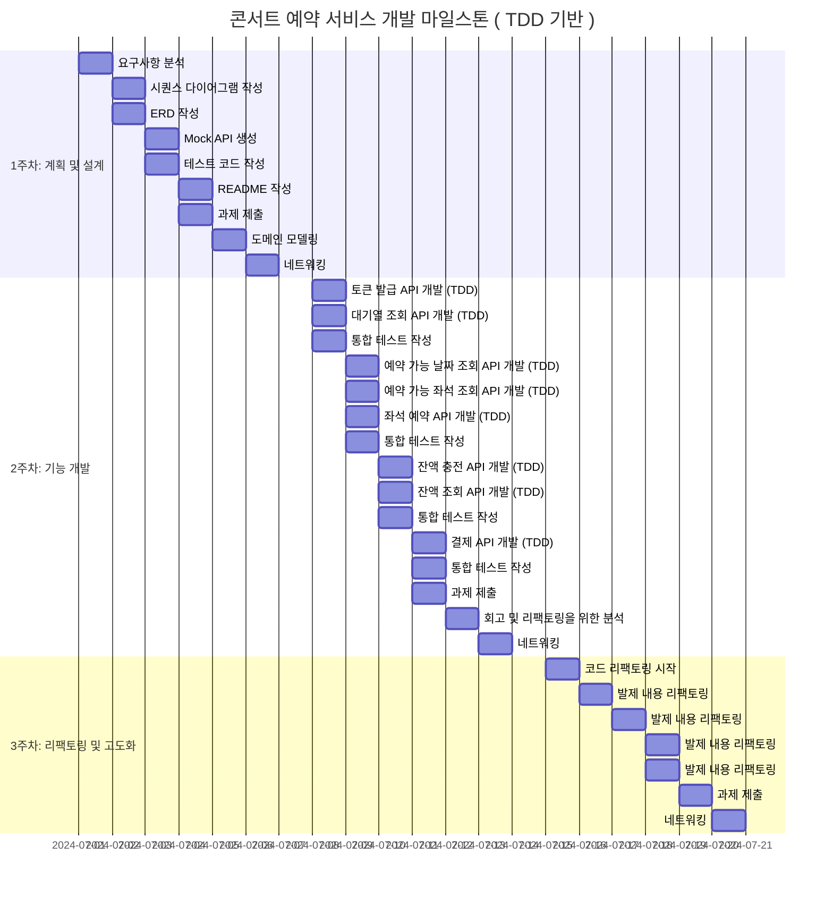
</details>

## Sequence
<details>
<summary>💡 Sequence Diagrams</summary>

</Br>

<details>
<summary> 토큰 발급 API (POST)</summary>

### 토큰 발급 API (POST)
> 대기열 토큰 발급
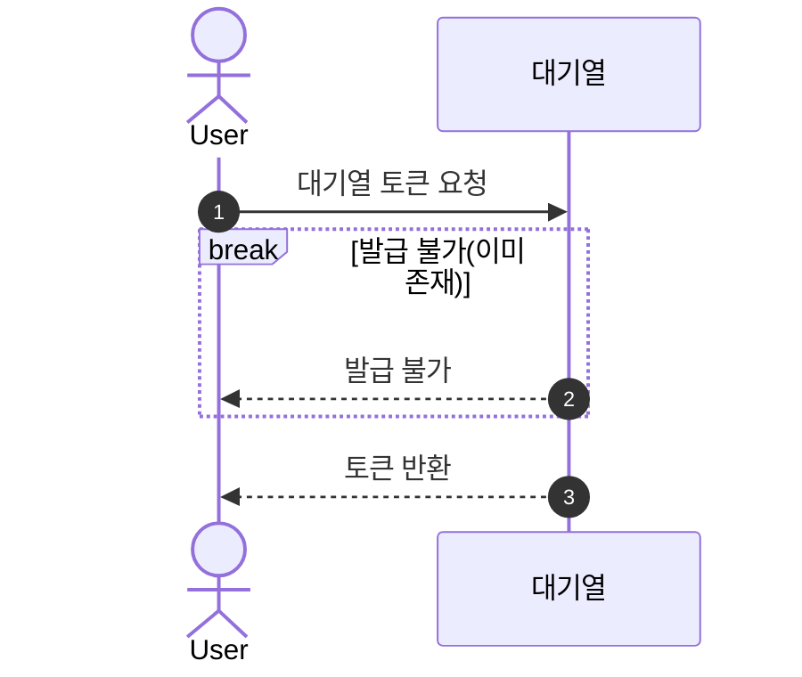
</details>

<details>
<summary> 대기열 상태 확인 API (GET)</summary>

### 대기열 상태 확인 API (GET)
> 대기열 상태 확인
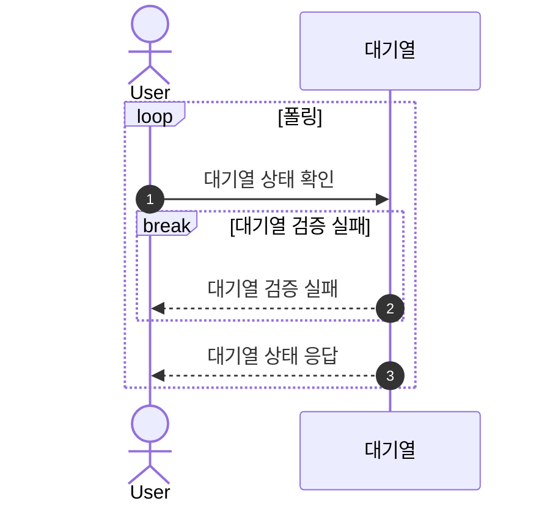
</details>

<details>
<summary> 예약 가능 날짜 조회 API (GET)</summary>

### 예약 가능 날짜 조회 API (GET)
> 예약 가능 좌석 조회
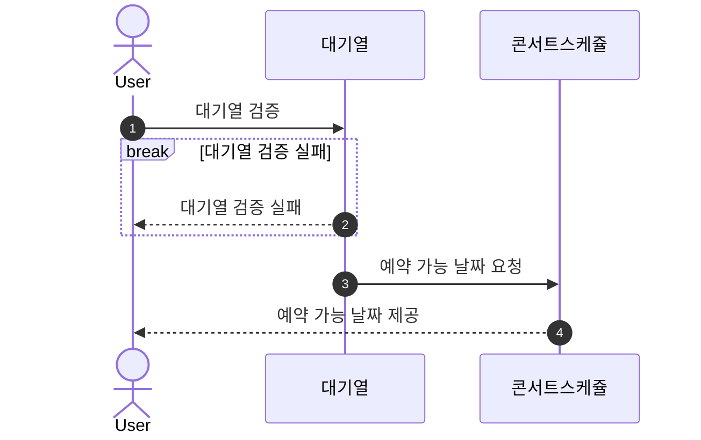
</details>

<details>
<summary> 예약 가능 좌석 조회 API (GET)</summary>

### 예약 가능 좌석 조회 API (GET)
> 예약 가능 좌석 조회
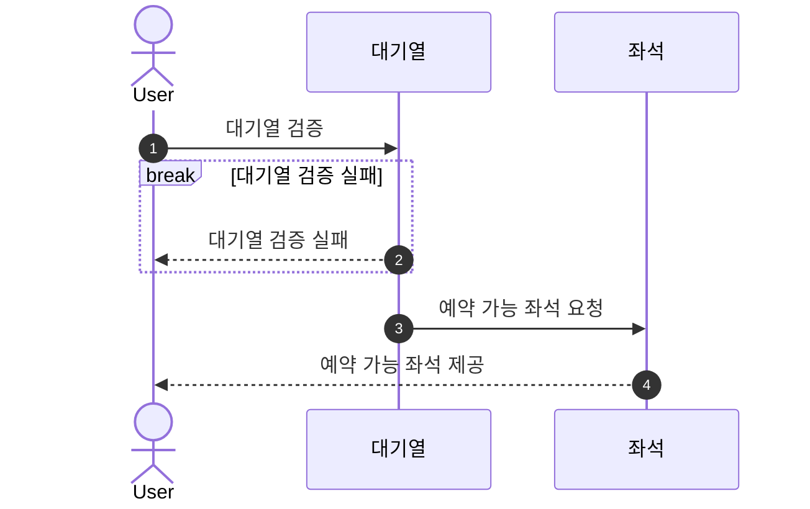
</details>

<details>
<summary> 잔액 충전 API (POST)</summary>

### 잔액 충전 API (POST)
> 예약 가능 좌석 조회 요청

</details>

<details>
<summary> 잔액 조회 API (GET)</summary>

### 잔액 조회 API (GET)
> 예약 가능 좌석 조회
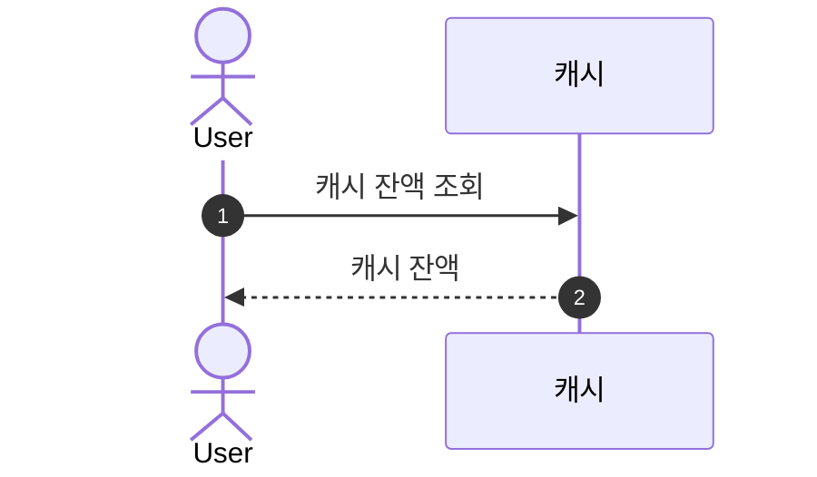
</details>

<details>
<summary> 좌석 예약 API (POST)</summary>

### 좌석 예약 API (POST)
> 좌석 예약 요청
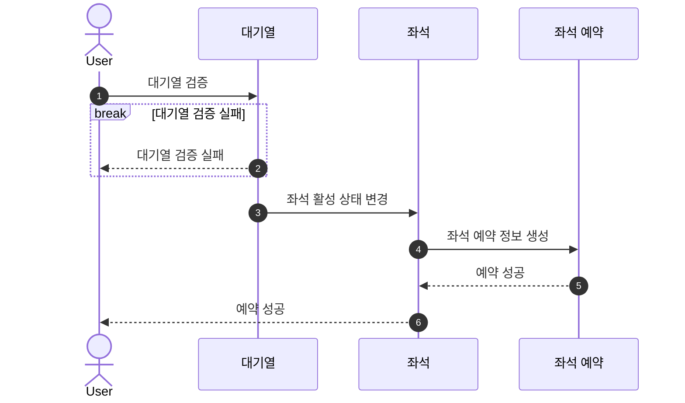
</details>

<details>
<summary> 결제 API (POST)</summary>

### 결제 API (POST)
> 결제
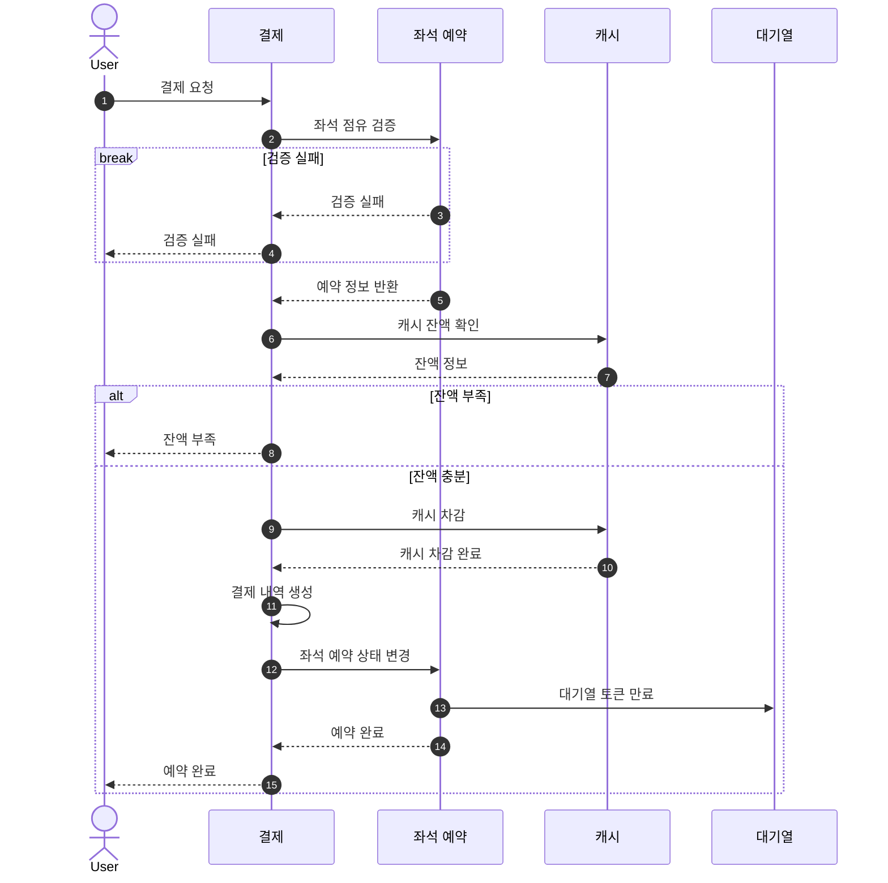
</details>

<details>
<summary> BACKGROUND-A</summary>

### BACKGROUND-A
> 대기열 만료 처리
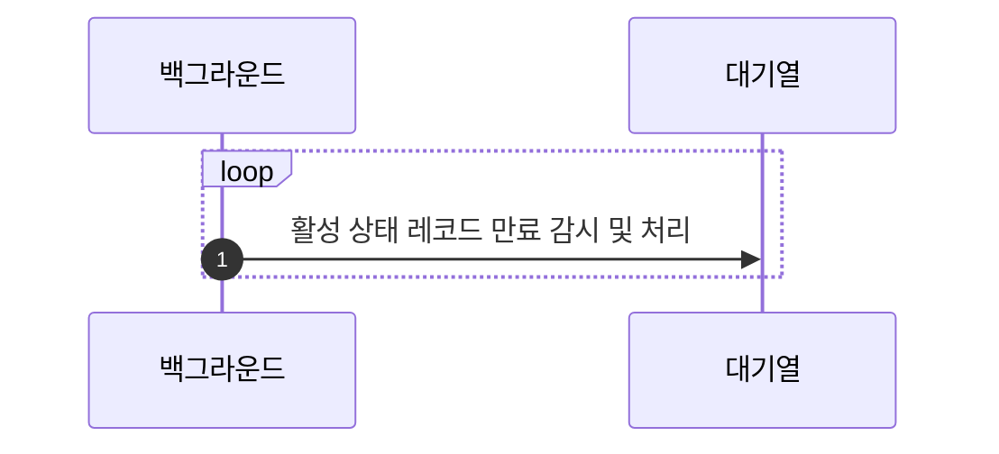
</details>

<details>
<summary> BACKGROUND-B</summary>

### BACKGROUND-B
> 좌석 예약 만료 처리
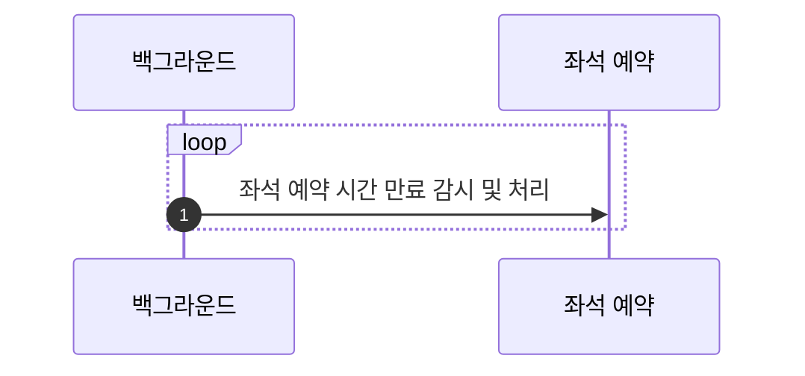
</details>

</details>


## ERD

<details>
<summary>🗂️ ERD</summary>


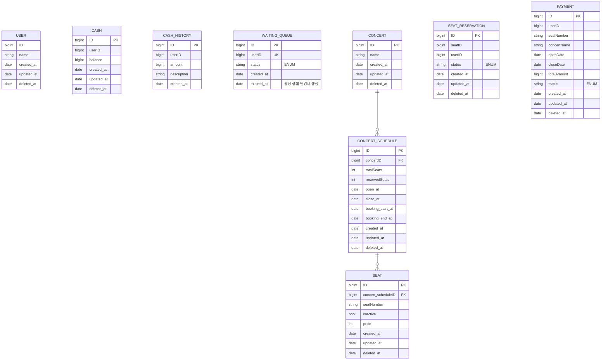
</details>


<!-- ## API

<details>
<summary>🔍 API Documentation</summary>

### API 명세서

#### 1. 유저 토큰 발급

- **경로**: `POST /queue/issue`
- **설명**: 대기열 토큰을 발급받습니다.
- **Request**:
    - **Body**
        - `userId`: `string` - 사용자 ID
- **Response**:
    - **200 OK**:
        ```json
        {
          "success": true,
          "data": {
            "token": "queue-uuid",
            "status": "pending"
          }
        }
        ```
    - **400 Bad Request**: `userId`가 유효하지 않을 때
        ```json
        {
          "success": false,
          "message": "Invalid userId"
        }
        ```

#### 2. 예약 가능 날짜 조회

- **경로**: `GET /concert/available-dates`
- **설명**: 예약 가능한 날짜 목록을 조회합니다.
- **Request**: 
    - **Headers**
        - `queue-token`: `string` - 대기열 토큰
- **Response**:
    - **200 OK**:
        ```json
        {
          "success": true,
          "data": [
            {
              "id": 1,
              "totalSeats": 50,
              "reservedSeats": 38,
              "open_at": "2024-01-01T00:00:00",
              "close_at": "2024-01-01T00:00:00"
            },
            {
              "id": 2,
              "totalSeats": 50,
              "reservedSeats": 48,
              "open_at": "2024-01-03T00:00:00",
              "close_at": "2024-01-03T00:00:00"
            }
          ]
        }
        ```
    - **401 Unauthorized**: 큐 토큰이 없거나 유효하지 않을 때
        ```json
        {
          "success": false,
          "message": "Unauthorized"
        }
        ```

#### 3. 예약 가능 좌석 조회

- **경로**: `GET /concert/available-seats`
- **설명**: 특정 콘서트 일정에 예약 가능한 좌석 목록을 조회합니다.
- **Request**:
    - **Headers**
        - `queue-token`: `string` - 대기열 토큰
    - **Query Parameters**
        - `concertScheduleId`: `number` - 콘서트 일정 ID
- **Response**:
    - **200 OK**:
        ```json
        {
          "success": true,
          "data": [
            {
              "id": 1,
              "seatNumber": "1",
              "price": 1000
            },
            {
              "id": 2,
              "seatNumber": "50",
              "price": 5000
            }
          ]
        }
        ```
    - **400 Bad Request**: `concertScheduleId`가 유효하지 않을 때
        ```json
        {
          "success": false,
          "message": "Invalid concertScheduleId"
        }
        ```
    - **401 Unauthorized**: 큐 토큰이 없거나 유효하지 않을 때
        ```json
        {
          "success": false,
          "message": "Unauthorized"
        }
        ```

#### 4. 좌석 예약 요청

- **경로**: `POST /reservation`
- **설명**: 좌석 예약을 요청합니다.
- **Request**:
    - **Headers**
        - `queue-token`: `string` - 대기열 토큰
    - **Body**
        - `seatId`: `number` - 좌석 ID
- **Response**:
    - **200 OK**:
        ```json
        {
          "success": true,
          "data": {
            "id": 1,
            "seat": {
              "id": 1,
              "isActive": false,
              "seatNumber": 1
            },
            "status": "PENDING",
            "created_at": "2024-01-01T00:00:00"
          }
        }
        ```
    - **400 Bad Request**: `seatId`가 유효하지 않을 때
        ```json
        {
          "success": false,
          "message": "Invalid seatId"
        }
        ```
    - **401 Unauthorized**: 큐 토큰이 없거나 유효하지 않을 때
        ```json
        {
          "success": false,
          "message": "Unauthorized"
        }
        ```

#### 5. 잔액 충전

- **경로**: `POST /user/charge`
- **설명**: 유저의 포인트를 충전합니다.
- **Request**:
    - **Body**
        - `amount`: `number` - 충전할 금액
        - `userId`: `string` - 사용자 ID
- **Response**:
    - **200 OK**:
        ```json
        {
          "success": true,
          "data": {
            "balance": 1000
          }
        }
        ```
    - **400 Bad Request**: `amount`나 `userId`가 유효하지 않을 때
        ```json
        {
          "success": false,
          "message": "Invalid amount or userId"
        }
        ```

#### 6. 잔액 조회

- **경로**: `GET /user/check`
- **설명**: 유저의 포인트 잔액을 조회합니다.
- **Request**:
    - **Query Parameters**
        - `userId`: `string` - 사용자 ID
- **Response**:
    - **200 OK**:
        ```json
        {
          "success": true,
          "data": {
            "balance": 1000
          }
        }
        ```
    - **400 Bad Request**: `userId`가 유효하지 않을 때
        ```json
        {
          "success": false,
          "message": "Invalid userId"
        }
        ```

#### 7. 결제 요청

- **경로**: `POST /payment`
- **설명**: 결제를 요청합니다.
- **Request**:
    - **Headers**
        - `queue-token`: `string` - 대기열 토큰
    - **Body**
        - `seatId`: `number` - 좌석 ID
- **Response**:
    - **200 OK**:
        ```json
        {
          "success": true,
          "data": {
            "seatNumber": 1,
            "concertName": 1,
            "openDate": "2024-01-01T00:00:00",
            "closeDate": "2024-01-01T00:00:00",
            "totalAmount": 1000,
            "status": "PENDING"
          }
        }
        ```
    - **400 Bad Request**: `seatId`가 유효하지 않을 때
        ```json
        {
          "success": false,
          "message": "Invalid seatId"
        }
        ```
    - **401 Unauthorized**: 큐 토큰이 없거나 유효하지 않을 때
        ```json
        {
          "success": false,
          "message": "Unauthorized"
        }
        ```
</details> -->

## Swagger

<details>
<summary>🔍 Swagger </summary>
<br>


<br>


<br>


<br>


<br>


<br>


<br>


<br>


</details>